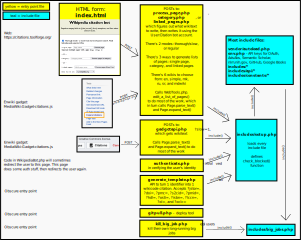

# Citation bot

## GitHub repository details
- The **master** code is implemented at https://citations.toolforge.org/, and is intended for public use.
- When needed, the **development** branch is intended for major restructuring and testing.  

## Overview

This is some basic documentation about what this bot is and how some of the parts connect.

This is more properly a bot-gadget-tool combination. The parts are:

* Citation Bot, found in `index.html` (web frontend) and `process_page.php` (information is
  POSTed to this and it does the citation expansion; backend). This automatically
  posts a new page revision with expanded citations and thus requires a bot account.
  All activity takes place on Tool Labs.  Single pages can be GETed.
* Citation expander (https://en.wikipedia.org/wiki/MediaWiki:Gadget-citations.js) + `gadgetapi.php`. This
  comprises an Ajax front-end in the on-wiki gadget and a PHP backend API.
* `generate_template.php` creates the wiki reference given an identifier (for example: https://citations.toolforge.org/generate_template.php?doi=10.1109/SCAM.2013.6648183)

Bugs and requested changes are listed here: https://en.wikipedia.org/wiki/User_talk:Citation_bot.

## Web Interface vs. Gadget: Slow Mode Differences

The Citation Bot has two main user-facing interfaces with different performance characteristics:

### Web Interface (`index.html` + `process_page.php`)
* **Default mode**: Thorough mode (slow mode enabled via checkbox, checked by default)
* **Slow mode operations**: Searches for new bibcodes and expands URLs via external APIs
* **Use case**: Users who want comprehensive citation expansion and can wait longer
* **Timeout limit**: Typically completes for all pages, even if the web interface times out

### Citation Expander Gadget (`gadgetapi.php`)
* **Default mode**: Fast mode only (slow mode is always disabled)
* **Operations performed**: 
  - ✓ Expands PMIDs, DOIs, arXiv, JSTOR IDs to full citations
  - ✓ Adds missing citation parameters (authors, title, journal, date, pages, etc.)
  - ✓ Cleans up citation formatting and fixes template types
* **Operations skipped**: 
  - ✗ Searching for new bibcodes
  - ✗ Expanding URLs via Zotero
* **Why fast mode only**: The gadget is designed for quick, in-browser citation expansion. Slow mode operations (bibcode searches and URL expansions) can exceed the web browser's connection timeout limit, causing the gadget to fail.
* **Use case**: Quick citation cleanup and expansion while editing Wikipedia articles

**Note**: Both interfaces perform core citation expansion effectively. The gadget sacrifices some thoroughness for speed and reliability to provide a better in-browser editing experience.

## Structure

Basic structure of a Citation bot script:
* the `env.php` that defines configuration constants (you can create it from `env.php.example`)
* the `setup.php` that sets up the functions needed (usually, you don't need to modify this file)
* the Page functions to fetch/expand/post the page's text

A quick tour of the main files:
* `constants.php`: constants defined
* `WikipediaBot.php`: functions to facilitate HTTP access to the Wikipedia API.
* `NameTools.php`: defines name functions
* `setup.php`: sets up needed functions, requires most of the other files listed here
* `miscFns.php`: a variety of functions
* `URLtools.php`: normalize urls and extract information from urls
* `TextTools.php`: string manipulation functions including converting to wiki
* `WebTools.php`: things unique to the web interface
* `API*.php`: sets up needed functions for expanding pmid/doi/url/etc
* `Page.php`: Represents an individual page to expand citations on. Key methods are
  `Page::get_text_from()`, `Page::expand_text()`, and `Page::write()`.
* `Template.php`: most of the actual expansion happens here.
  `Template::add_if_new()` is generally (but not always) used to add
   parameters to the updated template; `Template::tidy()` cleans up the
   template, but may add parameters as well and have side effects.
* `WikiThings.php`: Handles comments, nowiki, etc. tags
* `Parameter.php`: contains information about template parameter names, values,
   and metadata, and methods to parse template parameters.

## Style and structure notes

Constants and definitions should be provided in `constants.php`.
Classes should be in individual files. The code is generally written densely. 
Beware assignments in conditionals, one-line `if`/`foreach`/`else` statements, 
and action taking place through method calls that take place in assignments or equality checks. 
Also beware the difference between `else if` and `elseif`.

## Deployment

The bot requires PHP >= 8.4.

To run the bot from a new environment, you will need to create an `env.php` file (if one doesn't already exist) that sets the needed authentication tokens as environment variables. To do this, you can rename `env.php.example` to `env.php`, set the variables in the file, and then make sure the file is not world readable or writable:

    chmod go-rwx env.php

 To run the bot as a webservice from WM Toolforge:

    become citations[-dev]
    webservice stop
    webservice --backend=kubernetes php8.4 start

Or for testing in the shell:

    webservice --backend=kubernetes php8.4 shell

Before entering the k8s shell, it may be necessary to install phpunit (as wget is not available in the k8s shell).

## Running on the command line
In order to run on the command line one needs OAuth tokens as documented in `env.php.example` (there are additional API keys that are needed to run some functions).  Change BOT_USER_AGENT in `setup.php` to something else. Use composer to `composer require mediawiki/oauthclient:2.3.0`.  Then the bot can be run such as:

    /usr/bin/php ./process_page.php "Covid Watch|Water|COVID-19_apps" --slow --savetofiles
    
The command line tool will also accept `page_list.txt` and `page_list2.txt` as page names.  In those cases the bot expects a file of such name to contain a single line of | separated page names.  This code requires PHP 8.4 with optional packages included: php84-mbstring php84-sockets php84-opcache php84-openssl php84-xmlrpc php84-gettext php84-curl php84-intl php84-iconv

Command line parameters:
* `--slow` - retrieve bibcodes and expand urls
* `--savetofiles` - save processed pages as files (with .md extension) instead of submitting them to Wikipedia

## Running in web browser locally
One way to set up a localhost that runs in your web browser is to use Docker. Install [Docker Desktop](https://www.docker.com/products/docker-desktop/) on your computer, open a shell, `cd` to the root directory of this repo, type `docker compose up -d`, then visit https://localhost:8081.

To install Composer dependencies, start the container as noted above, then type `docker exec -it citation-bot-php-1 composer update`.

To do most bot tasks, you'll need to create an env.php file and populate it with API keys. See env.php.example in the root.
