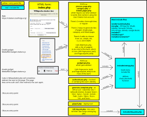

# Citation bot

## GitHub repository details

- The **master** code is implemented at <https://citations.toolforge.org/>, and is intended for public use.
- When needed, the **development** branch is intended for major restructuring and testing.

## Overview

Citation Bot automatically expands and formats references on Wikipedia when requested by a user.

This is more properly a bot-gadget-tool combination. The parts are:

- Citation Bot, found in `src/index.php` (web frontend) and `src/process_page.php` (information is POSTed to this and it does the citation expansion; backend). This automatically posts a new page revision with expanded citations and thus requires a bot account. The public production deployment runs on Toolforge. Single pages can be requested via GET, which requires prior web authorization (a `CiteBot` cookie); use the web form (POST) or CLI for multiple pages.
- Citation expander (<https://en.wikipedia.org/wiki/MediaWiki:Gadget-citations.js>) + `src/gadgetapi.php`. This comprises an Ajax front-end in the on-wiki gadget and a PHP backend API.
- `src/generate_template.php` creates the wiki reference given an identifier (for example: <https://citations.toolforge.org/generate_template.php?doi=10.1109/SCAM.2013.6648183>)

Bugs and requested changes are listed here: <https://en.wikipedia.org/wiki/User_talk:Citation_bot>.

## Web Interface vs. Gadget: Slow Mode Differences

The Citation Bot has two main user-facing interfaces with different performance characteristics:

### Web Interface (`src/index.php` + `src/process_page.php`)

- **Default mode**: Thorough mode (slow mode enabled via checkbox, checked by default)
- **Slow mode operations**: Searches for new bibcodes and expands URLs via external APIs
- **Use case**: Users who want comprehensive citation expansion and can wait longer
- **Timeout limit**: Request processing is bounded by `set_time_limit(120)` and internal size caps (`MAX_PAGES`: 50 for web, unlimited for CLI); thorough mode can use the full budget

### Citation Expander Gadget (`src/gadgetapi.php`)

- **Default mode**: Fast mode (slow mode is not requested by the on-wiki gadget)
- **Operations performed**:
  - ✓ Expands PMIDs, DOIs, arXiv, JSTOR IDs to full citations
  - ✓ Adds missing citation parameters (authors, title, journal, date, pages, etc.)
  - ✓ Cleans up citation formatting and fixes template types
- **Operations skipped**:
  - ✗ Searching for new bibcodes
  - ✗ Expanding URLs via Zotero
- **Why fast mode only**: The gadget is designed for quick, in-browser citation expansion.  Slow mode operations (bibcode searches and URL expansions) can exceed the web browser's connection timeout limit, causing the gadget to fail.
- **Use case**: Quick citation cleanup and expansion while editing Wikipedia articles

**Note**: Both interfaces perform core citation expansion effectively. The gadget sacrifices some thoroughness for speed and reliability to provide a better in-browser editing experience.

## Big-run gate (interactive-capacity reservation)

Web processing of more than 4 runnable pages is admission-controlled so
interactive/small work retains worker capacity while bulk work is bounded.
This is capacity reservation rather than scheduler priority: Citation Bot does
not reorder FastCGI requests after they reach the web server.

- **Discovery-probe pool:** category and linked-page entry points acquire a
  short-lived probe lease **before their first remote discovery API call**.
  Probe leases spend no tokens and use a separate pool (default 4), bounding
  worker occupancy even when the first upstream request is slow. Once discovery
  proves the request is bulk, the same lease is atomically promoted into the
  normal bulk pool before further bulk discovery. A request that ultimately has
  <=4 runnable pages releases its probe/discovery lease before page processing.
- **Bulk concurrency pool:** default capacity is 10 discovery/running leases;
  at most 4 may be large (>=50 pages). Large classification happens during
  discovery at the 50th runnable page, before further discovery or token
  charging.
- **Worker-capacity invariant:** the reported live deployment uses 24 web
  workers. With defaults, at most 10 normal bulk leases plus 4 discovery probes
  can occupy workers through this subsystem, leaving roughly 10 workers for
  singles, gadget/API traffic, authentication, and other work. Keep
  `WEB_WORKER_COUNT > CITATION_BOT_BIG_RUN_MAX_TOTAL +
  CITATION_BOT_BIG_RUN_MAX_DISCOVERY_PROBES`; re-check the custom worker count
  after migrations or web-service recreation. If the worker count changes,
  retune the gate before relying on its interactive-capacity guarantee.
- **Trusted operators:** `DEV_USERS` retain extended web page-count limits and
  are token-exempt, but still consume physical concurrency. Testing remains
  concurrency- and token-exempt. CLI remains outside the web gate only under
  the documented resource-isolation assumption.
- **Bounded discovery:** category enumeration stops at the accepted maximum + 1;
  linked-page enumeration uses paginated `generator=links`. After probe
  promotion, the existing fifth-runnable/raw-candidate/five-batch bounds remain
  defense in depth against unusual continuation behavior and mostly-filtered
  sources.
- **Per-user large-run ownership:** >=50-page requests also use the existing
  per-user lease. A persistent `_guard` file serializes acquisition, stale
  takeover, kill signaling, heartbeat and shutdown cleanup. Heartbeat verifies
  inode ownership; a resumed stale process cannot refresh or remove a newer
  replacement lease. Lease files prefer writable `/dev/shm` on Linux and fall
  back to `sys_get_temp_dir()/citation-bot-big-jobs` elsewhere.
- **Token bucket:** default capacity 400 and refill 4.0/s. Tokens are charged
  exactly once at direct admission or `discovery -> running` promotion.
  Requester-controlled `?edit=` attribution is normalized inside
  `big_run_token_cost()` and cannot choose a cheaper billing class.
- **Shared lease ownership:** probe, discovery and running entries carry
  `last_seen_at`. The common cURL path heartbeats before and after a transfer,
  and the cURL progress callback also renews the lease while `curl_exec()`
  is active; page-loop hooks provide an additional renewal point. A transient
  lock/storage failure is retryable; a valid state snapshot that no longer
  contains the request's lease is definitive ownership loss and stops that
  request. A pruned stale request therefore cannot resume as untracked work
  after capacity has been reassigned.
- **State integrity:** `big-run.lock` is the permanent `flock()` inode;
  `big-run.json` is atomically replaced through a flushed same-directory
  temporary file. The private state directory must be a real writable directory
  owned by the effective process user, and symlinked lock/state paths are
  rejected. State snapshots are capped at 64 KiB. A present snapshot must have
  valid `tokens`, `updated`, `entries`, and **every individual lease entry must
  validate**; one malformed entry fails the snapshot closed instead of being
  discarded and undercounting live work. Invalid-state logs distinguish
  unreadable, empty, oversized, JSON-decode, top-level schema/numeric, and
  individual-entry schema/value failures without logging snapshot contents.
- **Failure policy:** singles that never enter the gate remain available, while
  known bulk/probe work fails closed on gate-state, lock, schema or persistence
  failures. Pool saturation uses a fixed conservative retry; token pressure is
  derived from refill math plus the safety buffer.
- **HTTP behavior:** admission output is buffered only until the decision.
  Deferred or lease-lost bulk work returns 503 with `Retry-After` and
  `Cache-Control: no-store`; successful work flushes the buffer before normal
  progress streaming.
- **Tuning:** defaults may be overridden with
  `CITATION_BOT_BIG_RUN_MAX_TOTAL`,
  `CITATION_BOT_BIG_RUN_MAX_DISCOVERY_PROBES`,
  `CITATION_BOT_BIG_RUN_MAX_LARGE`,
  `CITATION_BOT_BIG_RUN_TOKEN_CAPACITY`,
  `CITATION_BOT_BIG_RUN_TOKEN_REFILL_PER_SECOND`,
  `CITATION_BOT_BIG_RUN_STALE_TIMEOUT_SECONDS`,
  `CITATION_BOT_BIG_RUN_HEARTBEAT_INTERVAL_SECONDS`, and
  `CITATION_BOT_BIG_RUN_POOL_RETRY_SECONDS`. Tune from interactive p95/p99
  latency, CPU/memory pressure, worker occupancy, and structured deferral logs.
- **Deployment topology:** the local JSON + `flock()` backend coordinates one
  shared-filesystem application instance. Keep the web service at one replica
  while using this backend; horizontal scaling requires a genuinely shared,
  transactional gate store.
- **Lock-protocol migration:** the first deployment that changes from locking
  `big-run.json` directly to permanent `big-run.lock` must be drained: stop the
  web service, let old php-cgi requests exit, update while stopped, clear the
  old state snapshot, then restart. V5.9 does not change the state schema or
  lock-inode protocol relative to v5.8, so a v5.8 -> v5.9 deployment requires no
  state deletion or migration. Apply release changes from a clean reviewed tree,
  quiesce the web service while replacing the gate code, run the validation
  suite, then restart workers.
- **CLI assumption:** CLI work bypasses the web admission gate only while it
  does not consume the same constrained web-worker envelope.
- **Observability:** structured reasons distinguish `probe_full`, `total_full`,
  `large_full`, `tokens`, `retry_later`, `lease_lost`, promotion failures, and
  invalid-state reasons including `state_unreadable`, `state_empty`,
  `state_oversized`, `json_decode`, `top_level_schema`, `top_level_numeric`,
  `entry_schema`, and `entry_value`.- **Operator recovery:** strict whole-snapshot validation deliberately does not
  auto-heal malformed state. An invalid snapshot emits a prominent
  `INVALID SHARED STATE (...)` log line while bulk admission remains
  fail-closed. Diagnose with `php tools/reset_big_run_state.php --check`.
  After draining/quiescing bulk workers, recover with
  `php tools/reset_big_run_state.php --reset`. Reset holds the permanent
  `big-run.lock`, rejects unsafe paths or lock contention, preserves any
  existing regular snapshot as a timestamped same-directory `.recovery-*`
  backup, and atomically installs an empty state with a full token bucket.
  Do not expose reset through HTTP and do not delete `big-run.lock`.

Implementation lives in `src/includes/RequestRateLimit.php`; web admission and
response buffering are in `src/includes/WebTools.php`; bounded discovery is in
`src/includes/WikipediaBot.php`; the per-user >=50-page lease is in
`src/includes/big_jobs.php`.

## Structure

Basic structure of a Citation bot script:

- the `src/env.php` that defines configuration constants (you can create it from `src/env.php.example`)
- the `src/includes/setup.php` that sets up the functions needed (usually, you don't need to modify this file)
- the Page functions to fetch/expand/post the page's text

A quick tour of the main files:

Entry points (under `src/`):

- `src/index.php`: web frontend
- `src/process_page.php`: backend; POSTed page information triggers citation expansion
- `src/gadgetapi.php`: PHP backend API for the on-wiki Citation Expander gadget
- `src/generate_template.php`: creates a wiki reference given an identifier
- `src/category.php`: processes all pages within a Wikipedia category
- `src/linked_pages.php`: processes all pages that are linked from a given `User:` page

Operational/support endpoints:

- `src/authenticate.php`: OAuth authorization flow for web users
- `src/gitpull.php`: password-protected deployment/update endpoint
- `src/kill_big_job.php`: lets users kill their own long-running batch jobs
- `src/update_statistics.php`: daily cron to update `User:Citation bot/statistics`

Includes (under `src/includes/`):

- `src/includes/constants.php`: constants defined; further constants are split into files under `src/includes/constants/`
- `src/includes/WikipediaBot.php`: functions to facilitate HTTP access to the Wikipedia API.
- `src/includes/Statistics.php`: UCB tag parsing and statistics wikitext generation for `User:Citation bot/statistics`
- `src/includes/GadgetApi.php`: gadget request validation and rate-limiting helpers
- `src/includes/PublicConfig.php`: public URL/host/origin canonicalization and CORS helpers
- `src/includes/RequestRateLimit.php`: token-bucket rate limiting for gadget/generate-template requests, plus the big-run admission gate that gives single requests priority over bulk runs
- `src/includes/request_security.php`: CSRF and session security helpers for web entrypoints
- `src/includes/NameTools.php`: defines name functions
- `src/includes/MathTools.php`: converts MathML notation to LaTeX for Wikipedia citations
- `src/includes/setup.php`: sets up needed functions, requires most of the other files listed here
- `src/includes/miscTools.php`: a variety of functions
- `src/includes/URLtools.php`: normalize URLs and extract information from URLs
- `src/includes/TextTools.php`: string manipulation functions including converting to wiki
- `src/includes/WebTools.php`: things unique to the web interface, including the big-run gate (`gate_big_run`)
- `src/includes/bot_curl.php`: curl wrapper with bot-appropriate defaults and timeouts
- `src/includes/user_messages.php`: functions for reporting bot activity to users
- `src/includes/doiTools.php`: DOI-specific validation and normalization functions
- `src/includes/big_jobs.php`: handling for large batch jobs
- `src/includes/api/API*.php`: sets up needed functions for expanding PMID/DOI/URL/etc. Note: `APIissn.php` and `APIsici.php` are loaded directly by `Page.php` and `Template.php` rather than through `setup.php`.
- `src/includes/Page.php`: Represents an individual page to expand citations on. Key methods are `Page::get_text_from()`, `Page::expand_text()`, and `Page::write()`.
- `src/includes/Template.php`: most of the actual expansion happens here. `Template::add_if_new()` is generally (but not always) used to add parameters to the updated template; `Template::tidy()` cleans up the template, but may add parameters as well and have side effects.
- `src/includes/WikiThings.php`: Handles comments, nowiki, etc. tags
- `src/includes/Parameter.php`: contains information about template parameter names, values, and metadata, and methods to parse template parameters.

## Style and structure notes

- Constants and definitions should be provided in `constants.php`.
- Entry points that do not load `src/includes/setup.php` (currently `src/kill_big_job.php`) must define the `CI` and `HTML_OUTPUT` constants themselves, as the output helpers in `src/includes/user_messages.php` read them unguarded. `setup.php` defines these based on the run context (CLI vs web); see `src/kill_big_job.php` for a web-only example.
- A good balance between splitting functionality into single files and avoiding too many files should be maintained.
- The code is generally NOT written densely.
- Beware assignments in conditionals, one-line `if`/`foreach`/`else` statements, and action taking place through method calls that take place in assignments or equality checks.
- Also beware the difference between `else if` and `elseif`.

## Deployment

The bot requires PHP >= 8.4.

To run the bot from a new environment, you will need to create an `src/env.php` file (if one doesn't already exist) that sets the needed authentication tokens as environment variables.  To do this, you can rename `src/env.php.example` to `src/env.php`, set the variables in the file, and then make sure the file is not world readable or writable:

    chmod go-rwx src/env.php

Every deployment must configure `PUBLIC_BASE_URL`, the canonical externally visible URL (including any deployment path) used for OAuth callbacks, redirects, HTTP referrers, and User-Agent identification. Web deployments must also configure `ALLOWED_HOSTS` and `ALLOWED_ORIGINS`. `ALLOWED_HOSTS` is a comma-separated list of exact HTTP Host values, including ports where applicable. `ALLOWED_ORIGINS` is a comma-separated CORS allowlist; entries are origins without paths, and a left-most wildcard such as `https://*.wikipedia.org` is supported. The host from `PUBLIC_BASE_URL` must also appear in `ALLOWED_HOSTS`.

The big-run admission gate also accepts optional `CITATION_BOT_BIG_RUN_*` tuning variables documented in `src/env.php.example`. Normally leave them unset to use the reviewed defaults; tune them only from measured interactive latency, CPU/memory pressure, and structured deferral reasons.

When upgrading from a build that locks `big-run.json` directly to the permanent `big-run.lock` backend, perform a **drained deployment**. Stop the web service and wait for all old php-cgi requests to exit, update the code while the service is stopped, remove the old `big-run.json` snapshot from the configured rate-limit state directory, then restart the web service. Do not use the live `gitpull.php` endpoint for this one-time lock-protocol transition: old and new requests otherwise coordinate on different lock objects. Once every worker is running the new protocol, normal deployments may resume.

 To run the bot as a webservice from WM Toolforge:

    become citations[-dev]
    webservice stop
    webservice --backend=kubernetes php8.4 start

Or for testing in the shell:

    webservice --backend=kubernetes php8.4 shell

## Running on the command line

In order to run on the command line one needs OAuth tokens as documented in `src/env.php.example` (there are additional API keys that are needed to run some functions).  The bot's User-Agent strings (`BOT_USER_AGENT` and `BOT_CROSSREF_USER_AGENT`) are defined in `src/includes/constants.php`. Use Composer to install dependencies:

    composer install

Then the bot can be run such as:

    /usr/bin/php ./src/process_page.php "Covid Watch|Water|COVID-19_apps" --slow --savetofiles

The command line tool will also accept `page_list.txt` and `page_list2.txt` as page names.  In those cases the bot expects a file of such name to contain a single line of | separated page names.  This code requires PHP 8.4 with the following extensions installed: curl, mbstring, xml (SimpleXML). Additional extensions may be needed for development tools and test coverage.

Command line parameters:

- `--slow` - retrieve bibcodes and expand URLs
- `--savetofiles` - write changed page text only to sanitized `.md` filenames in the current working directory instead of submitting them to Wikipedia

## Running in web browser locally

One way to set up a localhost that runs in your web browser is to use Docker. Install [Docker Desktop](https://www.docker.com/products/docker-desktop/) on your computer, open a shell, `cd` to the root directory of this repo, type `docker compose up -d`, then visit <http://localhost:8081/src/>.

To install Composer dependencies, start the container as noted above, then type:

    docker compose exec php composer install

To do most bot tasks, you'll need to create an env.php file and populate it with API keys. See src/env.php.example in the src directory.

## Debugging when the bot is blocked

If the Citation Bot is currently blocked (i.e. `Citation_bot` is not a valid user on the target wiki), it will normally halt and display an error message.  For developers who need to test or debug the bot's behaviour during a block without writing to Wikipedia, the `ignore_block` URL parameter can be passed in the request.

When `ignore_block` is present, the bot displays a warning — "Running bot anyway, but it will fail to write." — and continues processing.  This is useful for inspecting what the bot would do without risking any edits to Wikipedia.

Example URL:

    https://citations.toolforge.org/process_page.php?page=Example&ignore_block=1

Secondly, even when blocked, a user can run the bot on their own User: pages, but the bot will edit as the user.

**Note:** In this mode all citation expansion runs normally, but the bot will fail when it attempts to write the results back to Wikipedia.  Use this only for debugging purposes.

## Submitting issues

Where issues require consensus on Wikipedia policy, they are discussed on the [Citation Bot Talk Page](https://en.wikipedia.org/wiki/User_talk:Citation_bot). Most other issues should also be discussed there.  The issues on GitHub are primarily for the developers' internal use.
